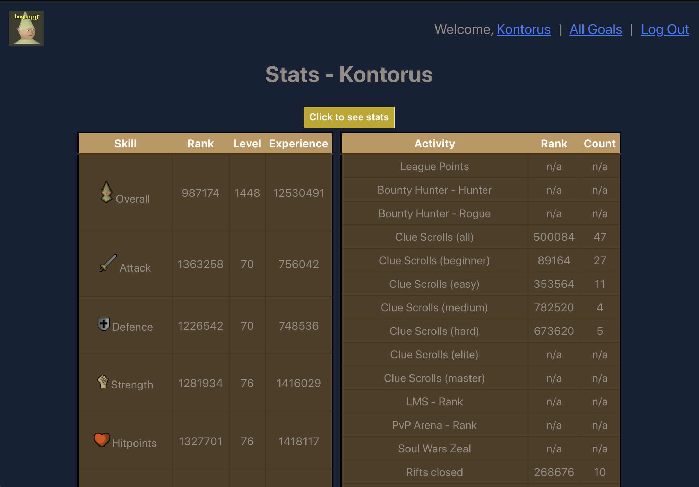
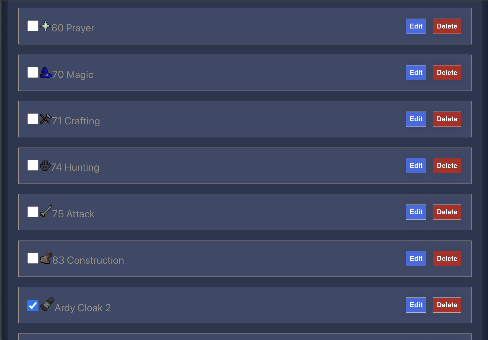

# HCGIM Tracker

The HCGIM Tracker was created as a lightweight alternative to the more bloated tracker created as a Google doc. In addition to a few pregenerated goals, a user can add, edit, and delete their own custom goals. They can also view their skills and other stats pulled from the OSRS index_lite API, so they can track their levels without needing to constantly update.

# Technologies Used

- MongoDB/Mongoose
- Express
- React
- Node
- OSRS index_lite API
- deployed on Heroku

# Links

[Click here](https://hcgim-tracker.herokuapp.com/goals) to test out the app. 
[Click here](https://trello.com/b/mZ4xIOzU/project-4) to see the Trello board to see the user stores, wireframe, and the ERD.

# Issues

☐ Unable to get useEffect to automatically fetch character stats, so the button is in place to initiate the fetch. It did work in localhost:3000, so might be an issue with updating the state.

☐ Page does not re-render after deleting a goal, so it currently navigates to the user profile page instead. Potentially another issue with updating the state, since clicking back to the goals index page does show it deleted from the list.

# Future Enhancements

- Allow multiple users to edit one list (group / clan based)
- More preset goals
- Get checkbox functionality working so that a user just needs to check the box to mark as completed
- See if RS3 APIs also work